## 1. 6T SRAM Bitcell Architecture & Operation

A standard 6T SRAM cell consists of two cross-coupled CMOS inverters that store a single bit of data (`Q` and `Qbar`), and two NMOS access transistors that connect the cell to the complementary bitlines (`BL` and `BLB`) under the control of the Wordline (`WL`).

```
          VDD               VDD
           |                 |
       +-------+         +-------+
       |  PU1  |         |  PU2  |
       +-------+         +-------+
           |                 |
 BL ---[  AXL  ]--- Q ------- Qbar ---[  AXR  ]--- BLB
           |       |         |       |
           |   +-------+ +-------+   |
           |   |  PD1  | |  PD2  |   |
           |   +-------+ +-------+   |
           |       |         |       |
          GND     GND       GND     GND
           ^                         ^
           |_________ WL ____________|
```

### Operational States:
* **Hold State ($WL = 0$):** The access transistors are turned off. The cross-coupled inverters reinforce each other, retaining the stored charge indefinitely as long as supply voltage ($V_{DD}$) is maintained.
* **Read State ($WL = 1$):** Both bitlines (`BL` and `BLB`) are precharged to $V_{DD}$. When `WL` is asserted, the side storing a '0' pulls its respective bitline down slightly, creating a differential voltage ($\Delta V_{BL}$).
* **Write State ($WL = 1$):** One bitline is driven to $V_{DD}$ and the other to $GND$. The access transistor overrides the weaker pull-up transistor inside the cell to flip the internal state if necessary.

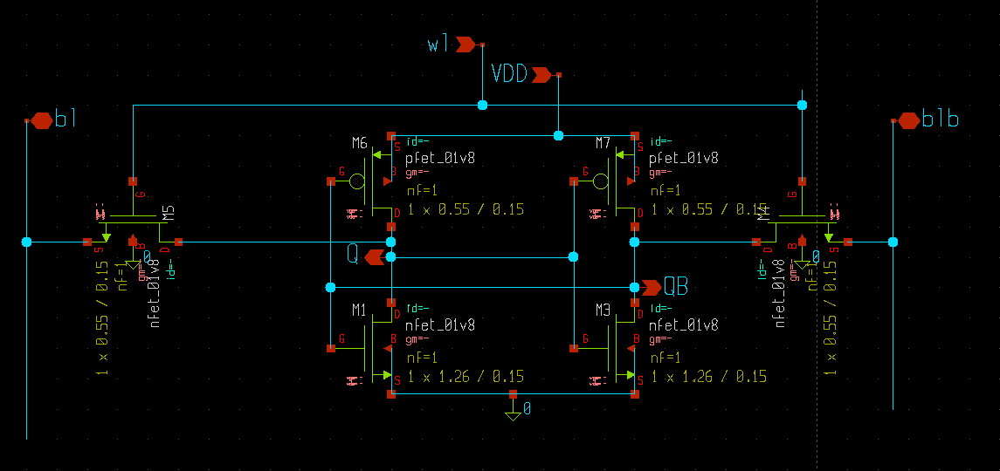

---

## 2. Read & Write Stability (The Butterfly Curve)

Cell stability dictates how reliably the cell retains its data during a read operation and how easily it can be modified during a write operation. This is quantified using **Static Noise Margin (SNM)**.

### The Butterfly Curve
The Static Noise Margin is evaluated by plotting the Voltage Transfer Characteristics (VTC) of one inverter against the inverse VTC of the second inverter. The resulting loop resembles the wings of a butterfly. 

* **Definition:** SNM is defined as the side length of the largest square that can be nested inside the smaller loop of the butterfly curve.

Hold SNM (HSNM)
Definition: HSNM is the SNM when the word‑line is off (access transistors off) so the cell is just the two cross‑coupled inverters holding a stored “0/1”.
Behavior: HSNM depends mainly on the strength ratio of the pull‑up (PMOS) and pull‑down (NMOS) transistors inside each inverter; larger device strengths (wider devices) for the inverter transistors and balanced sizing increase HSNM.

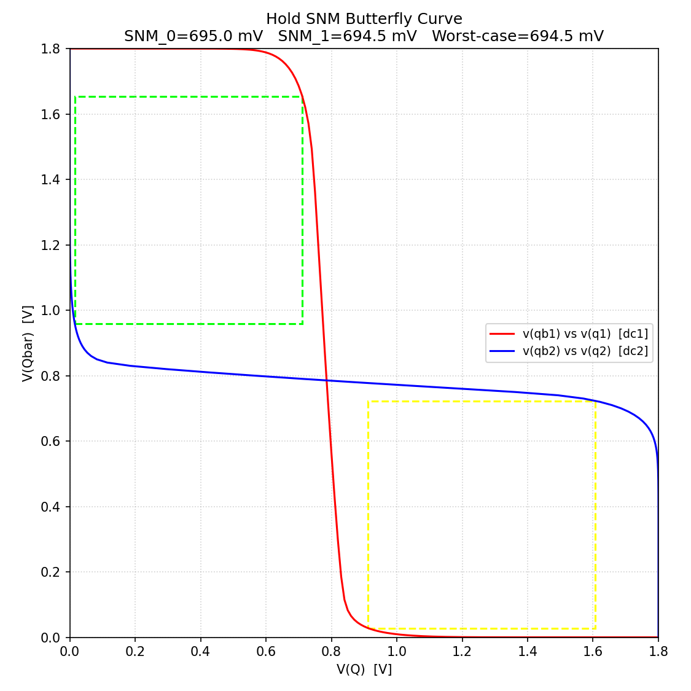

Read SNM (RSNM)
Definition: RSNM is the SNM measured with the word‑line asserted and bit‑lines precharged (read operation) — during read the access transistor forms a divider with the pull‑down transistor and raises the internal node storing ‘0’, which reduces margin.
Vulnerability: RSNM is typically the smallest SNM of the three modes because the access transistor weakens the effective pull‑down path and perturbs the latch voltage, producing a much smaller butterfly and smaller inscribed square.

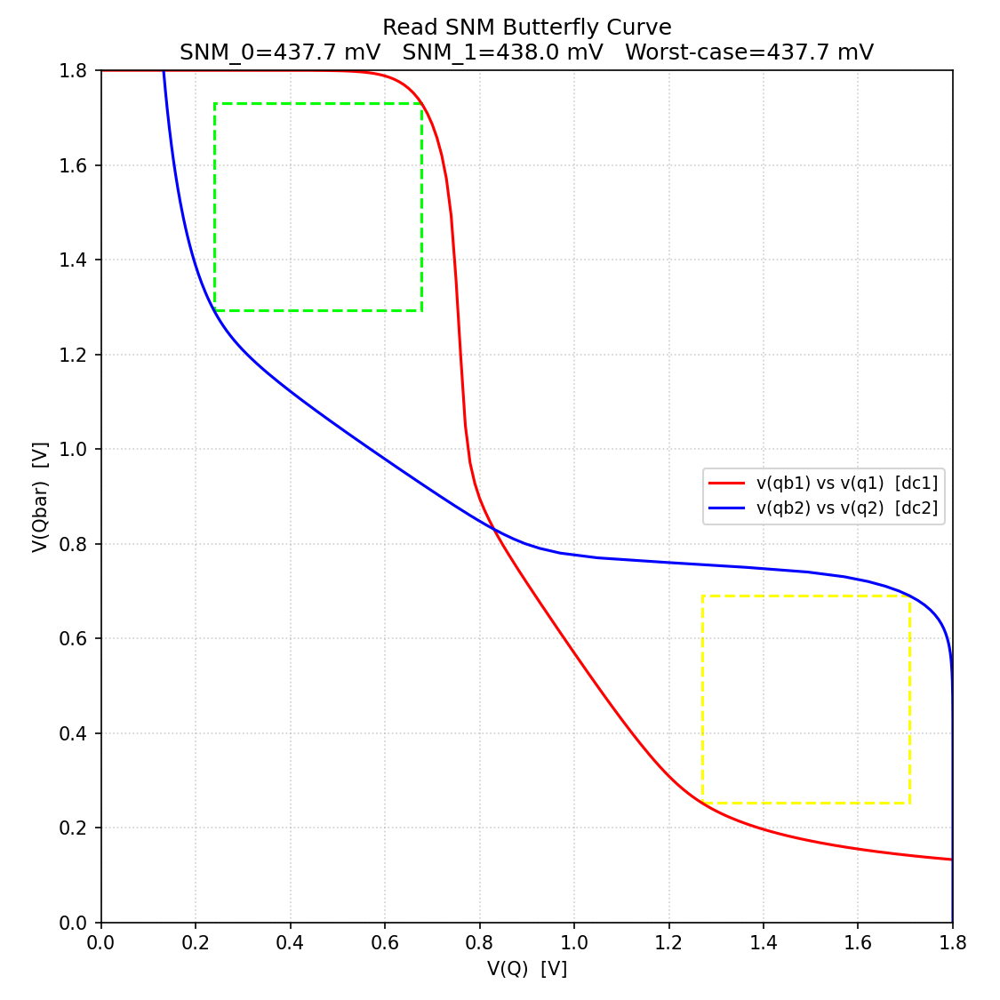

Write SNM / Write margin (WSNM)
Definition: Write SNM (often referred to as write margin) characterizes how easily the cell can be overwritten when a strong voltage is applied on bit‑lines and the word‑line is asserted.
Behavior: Successful write requires the access+bitline drive to overcome the feedback strength of the storing inverter; weaker cross‑coupled inverter pull‑ups/pull‑downs (relative to the access transistor) make writing easier (higher effective write margin).

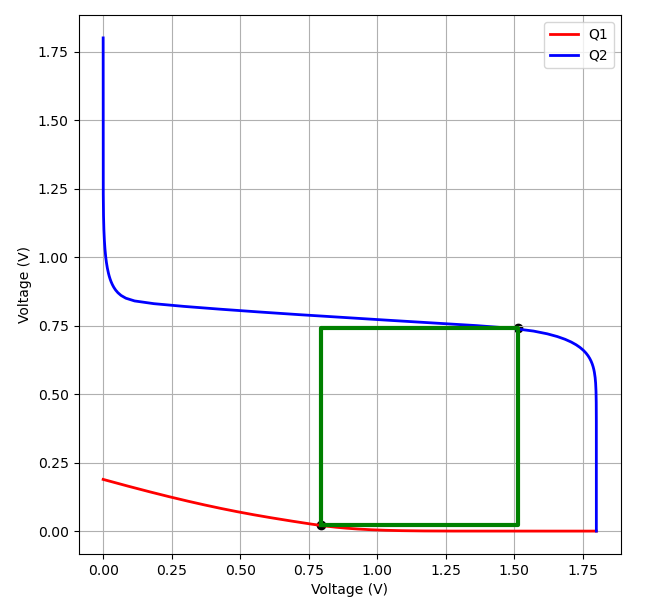

---

## 3. Read Disturb Phenomena

During a **Read** cycle, a critical vulnerability known as **Read Disturb** can occur. 

### Mechanism
Assume the cell stores $Q = 0$ and $Qbar = V_{DD}$, and both $BL$ and $BLB$ are precharged to $V_{DD}$.
1. When $WL$ rises to $V_{DD}$, the access transistor $AXL$ turns ON.
2. Current flows from $BL$ ($V_{DD}$) through $AXL$ and down through the pull-down transistor $PD1$ to $GND$.
3. Because $AXL$ and $PD1$ form a resistive voltage divider, the node $Q$ rises to a voltage above $GND$, denoted as $V_{read\_disturb}$.
4. If $V_{read\_disturb}$ exceeds the threshold voltage ($V_{th}$) of the opposite pull-down transistor $PD2$, the cell will flip its state inadvertently, causing a read failure.

### Sizing Rules for Read Stability:
To mitigate Read Disturb, the cell must have a strong **Cell Ratio ($CR$)**:
$$	ext{Cell Ratio (CR)} = rac{(W/L)_{PD}}{(W/L)_{AX}}$$
A higher $CR$ ensures that the pull-down transistor is significantly stronger than the access transistor, keeping $V_{read\_disturb}$ safely below $V_{th}$.

---

## 4. Write Margin Characterization

While Read operations require the cell to resist flipping, a **Write** operation explicitly requires the cell to flip as easily as possible. The metrics used to quantify this ease are **Write Margin (WM)** or **Write Noise Margin (WNM)**.

### Mechanism
Assume $Q = 1$ and $Qbar = 0$. To write a '0' into $Q$:
1. $BL$ is driven to $GND$ and $BLB$ is maintained at $V_{DD}$.
2. $WL$ is raised to $V_{DD}$.
3. The access transistor $AXL$ must pull node $Q$ down from $V_{DD}$ lower than the trip point of the $PD2$-$PU2$ inverter.

### Sizing Rules for Write Ability:
To allow an easy write, the cell must have a proper **Pull-up Ratio ($PR$)**:
$$	ext{Pull-up Ratio (PR)} = rac{(W/L)_{PU}}{(W/L)_{AX}}$$
The access transistor must overpower the internal pull-up transistor ($PU1$). Therefore, a lower $PR$ (stronger access transistor relative to the pull-up) improves the Write Margin.


* **N-Curve Analysis:** 

While the traditional "Butterfly Curve" method is widely used, it has a few drawbacks: it is time-consuming, complex, and difficult to use with automated inline testers. The N-curve method allows engineers to measure both voltage and current margins directly, making it an excellent standard for evaluating deep submicron CMOS technologies (e.g., 22nm to 65nm) and low-power/sub-threshold SRAM cells. 

Static Voltage Noise Margin (SVNM): The maximum DC voltage that can be applied to an internal node before the cell changes state.
Static Current Noise Margin (SINM): The maximum DC current that can be injected before the content of the cell flips.
Write Trip Voltage (WTV): The voltage drop required to flip the internal node.
Write Trip Current (WTI): The negative peak current needed to successfully write a new value into the cell.

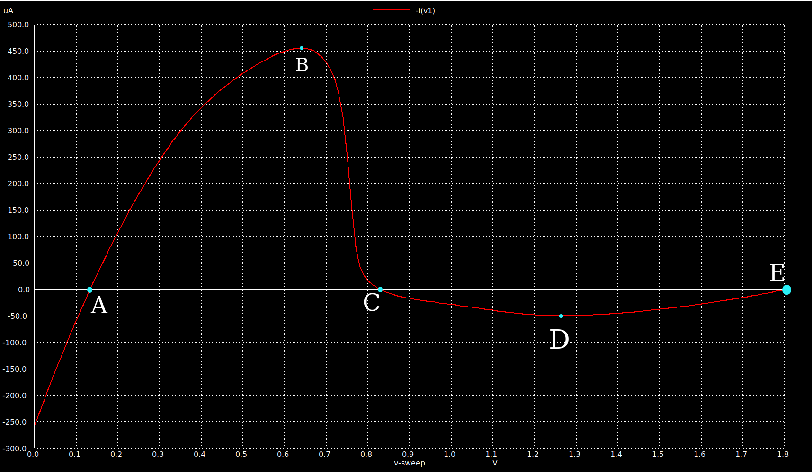

Measured values: 

SVNM = Point C - Point A = (0.829V - 0.132V) = 0.697V
SINM = Point B = 456.1uA
WTV = Point E - Point C = (1.8V - 0.829V) = 0.971V
WTI = Point D = -49.07uA

---

## 5. Peripheral Circuitry

An SRAM array relies heavily on surrounding control and conditioning circuits to read and write successfully.

### Precharge Circuit
Before every read and write cycle, the complementary bitlines must be equalized and charged to a known voltage state (typically $V_{DD}$).
* Consists of a PMOS network consisting of two pull-up transistors and one equalization transistor.
* The equalization transistor eliminates small voltage mismatches between $BL$ and $BLB$, preventing false read triggers.

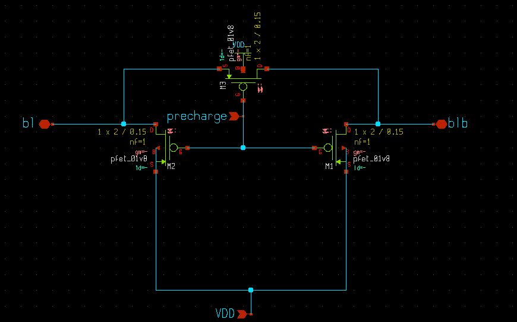

### Wordline Control Block
The Wordline Driver decodes the row addresses and drives the heavily capacitive $WL$ track high. 
* Must be designed with properly scaled buffer chains to minimize propagation delay.
* Controls the duration of the window during which the access transistors are open.

### Bitline Behaviour
* **Read Cycle:** Bitlines experience a slow differential discharge. Because bitlines span down columns across hundreds of cells, they have massive parasitic capacitances ($C_{BL}$). The cell pull-down transistor is small, so $\Delta V_{BL}$ develops slowly.
* **Write Cycle:** One bitline is driven completely to $0V$, while the other stays at $V_{DD}$. This requires a highly robust drive capability to overcome the large track capacitance quickly.

### Sense Amplifier
Because waiting for a small bitcell to fully discharge a large bitline capacitance would be extremely slow, a **Sense Amplifier (SA)** is deployed.
* **Concept:** The SA is a highly sensitive differential comparator (typically a voltage-latched topology).
* **Operation:** It samples a tiny differential voltage ($\Delta V_{BL}  approx 50	ext{mV} - 100	ext{mV}$) and rapidly amplifies it to full digital logic rails ($0V$ or $V_{DD}$), significantly boosting read speed.

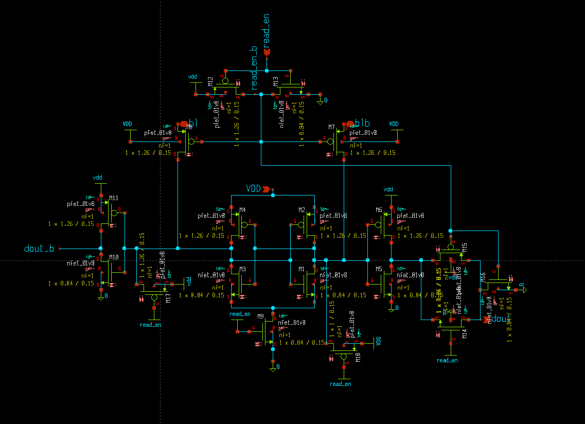

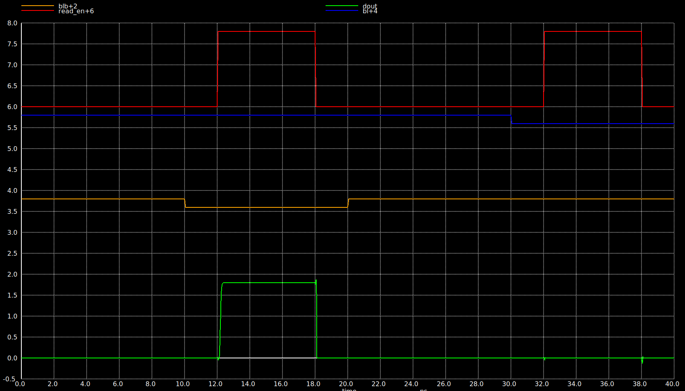

### Write Driver Concept
The Write Driver is responsible for pulling one of the heavily capacitive bitlines completely to ground during a write phase.

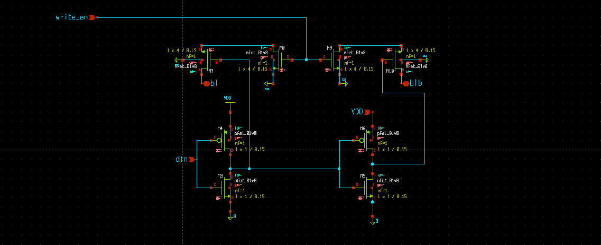

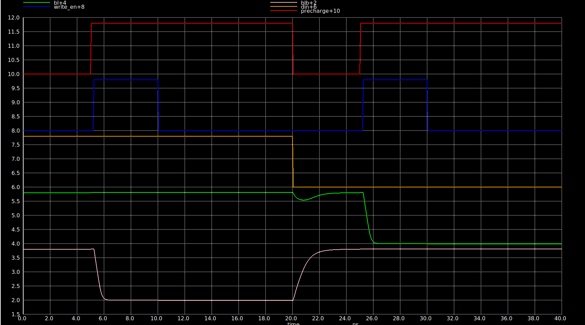

---

## 6. SRAM Timing Sequence & Control Logic

The execution of operations inside an SRAM macro occurs in a highly coordinated, time-sliced sequence driven by a system clock. 

### Typical Read Sequence:
1.  **Phase 1 (Precharge):** `PRE` signal goes active (Low for PMOS). $BL$ and $BLB$ are pulled up to $V_{DD}$.
2.  **Phase 2 (Evaluation/Wordline Activation):** `PRE` is deactivated. Row decoder asserts $WL$. Current flows, and a voltage differential begins to form on $BL/BLB$.
3.  **Phase 3 (Sensing):** Once a sufficient $\Delta V$ is established, the Sense Amplifier Enable (`SAEN`) signal is driven high. The SA latches and outputs full rail values.
4.  **Phase 4 (Output):** Data is registered to the output bus, and $WL$ drops back to 0.

### Typical Write Sequence:
1.  **Phase 1 (Data Setup):** Write Driver accepts input data and asserts one bitline to $GND$ and the other to $V_{DD}$.
2.  **Phase 2 (Wordline Activation):** $WL$ is driven high. The internal nodes flip state.
3.  **Phase 3 (Recovery):** $WL$ is deactivated, and the precharge circuitry turns back on to ready the lines for the next cycle.

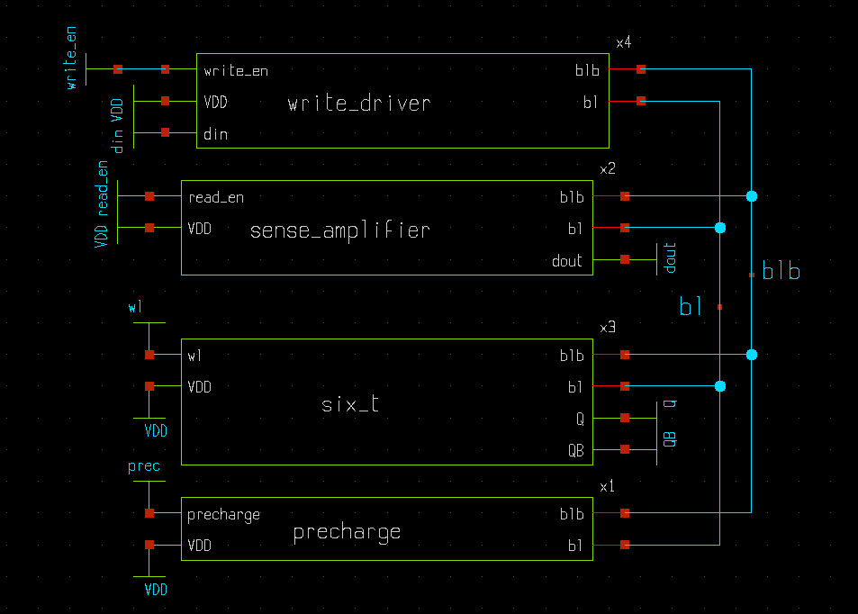

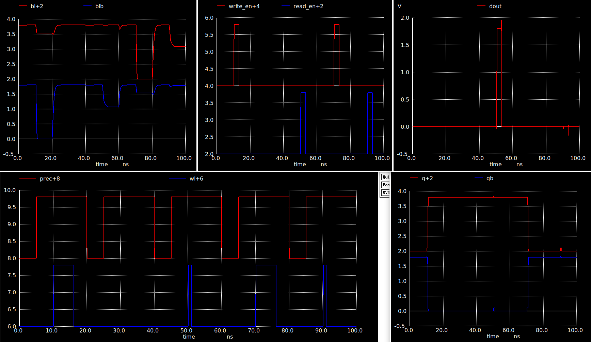

